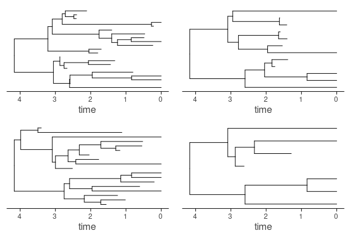
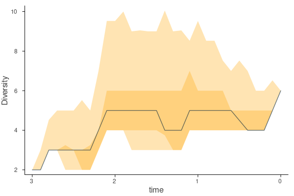
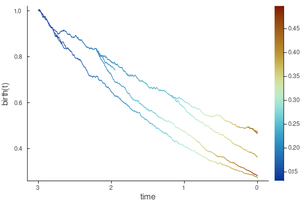

# Insane plots

Insane holds recipes to plot phylogenetic trees, results and perform aggregating functions. The output will rely in the number and type of arguments you provide.

First, however, we need to load the `Plots` package
```julia
using Plots
```

## Insane plots across all tree types

### Simple tree plot

The most basic plot function simply plots the tree:
```julia
plot(tree)
```


One can reorder the tree according to balance (have one daughter always have the largest number of tips) by using `reorder!(tree)`, which orders in place the tree and helps in visualization.

If one has a tree vector, we could, for example, sample ``4`` of them at random and simply plot them together using

```julia
ti = rand(tv,4)

p0 = plot(ti[1])
p1 = plot(ti[2])
p2 = plot(ti[3])
p3 = plot(ti[4])

plot(p0, p1, p2, p3)
```


If the tree is of type `sT_label` or `sTf_label`, labels will be shown automatically, but you can toggle this off with `showlabels = false`.

One can also plot the tree radially (as a fan) using
```julia
plot(tree, type = :radial)
```


For trees with fossils the fossilization events are shown as default, but one can change this. For instance, one can also add symbols in the plot for speciation and extinction events beside fossilization events. This can be set by the `shownodes` keyword, which receives a Boolean Tuple of size `3`, specifying, if speciation, extinction and fossil events should be shown, respectively. In the same order, with the keyword `shapes` you specify a vector of `Symbol`s with the shape (_e.g._, `:circle`), and, finally the keyword `colors`, in the same order, specifies the colors for each shape.
```julia
plot(tree, shownodes = (true, true, true), 
           shapes = [:circle, :circle, :square],
           shsizes = [3.0, 3.0, 3.0])
```


### LTT and DTT plots

We can plot the LTT or DTT by using the `ltt` result (of type `Ltt`, check (check [ Basic tree information](@ref))) as input:

```julia
plot(ltt(tree), linewidth = 2.0)
```


Moreover, if we input a vector of `Ltt` we will plot each LTT individually, or, better, if we add a decimal number argument, it will use it as sampling frequency through time and return the mean and desired quantiles of lineage or diversity through time using the arguments `q0` and `q1` (by default `q0 = [0.025, 0.975]` and `q1 = [0.25, 0.75]`):

```julia
lttv = ltt(tv)
plot(lttv, 0.1)
```


## Insane plots for trees with diffusion

These plotting functions are specific to BDD, FBDD or DBM type trees (_i.e._, of `iT` or `sTxs` supertype).

### Plot the rates on the tree

To "paint" the tree with the instantaneous lineage-specific rates of speciation ``\lambda(t)``, we can use:
```julia
plot(tree, birth)
```


!!! info 
    `birth`, which stands for "birth rates", is a convenience wrapper around `exp.(lλ(tree))`: it extracts the log-speciation vector from a give `iT` tree using `lλ`, and then returns the exponential.

This plotting function also allows to plot the death rates (only where extinction is also a diffusion, _i.e._, `iTbd`) using
```julia
plot(tree, death)
```

where `death`, which stands for "death rates" (_i.e._, extinction) is a wrapper around `exp.(lμ(tree))`.

In general, this plotting recipe receives a tree and a function that is applied recursively to paint the tree. Thus, we can use any custom made function that extracts information from the tree. Some predefined ones are:
* `logbirth`: log-(speciation) birth rates
* `logdeath`: log-(extinction) death rates 
* `turnover`: turnover (extinction/speciation) rates
* `diversification`: net diversification (speciation - extinction) rates
* `trait`: trait values
* `logtrait`: log trait values
* `traitrate`:  trait evolutionary rates ``\sigma^2(t)``
* `logtraitrate`: log trait evolution rates ``\sigma^2(t)``

!!! info
    One can also plot these trees radially using the `type = :radial`.

#### Plot the underlying rates along a tree

To plot how rates evolve across time, that is, to plot the rates in the y axis, one simply changes the argument order:
```julia
plot(birth, tree)
```


One can paint these rates by another variable, say, extinction rates, using
```julia
plot(birth, tree, zf = death)
```



Similarly, one can plot the average for a tree (or other aggregating function as median, geometric mean, _etc._) and custom quantiles (as in [LTT and DTT plots](@ref)) for a given tree by adding a decimal number argument representing the sampling frequency through time.
```julia
plot(birth, 0.1, tree)
```


To change the aggregating function, one can modify the function `t_af` (by default `t_af = mean`), to the desired one.

#### Plot the rates across tree vectors

Often one would like to plot the average rates across a series of data augmented trees. This can be done by adding a decimal number argument (and, using a tree vector as input).
For instance, to estimate average speciation rates (using wrapping function `birth`) through time across tree vector `tv`, every ``0.1`` time units, we use:
```julia
plot(birth, 0.1, tv)
```


One can choose the function to aggregate rates across lineages for each single tree using `af` (by default `af = mean`, and then to aggregate these tree averages using the `vaf` function (by default `vaf = x -> quantile(x, 0.5)`, that is, the median).

