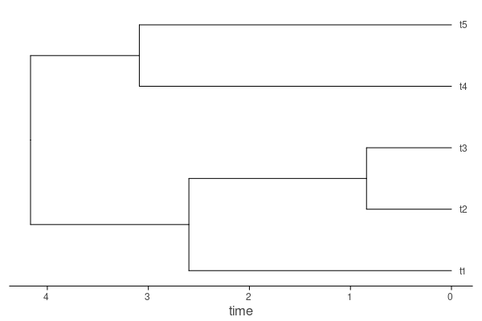
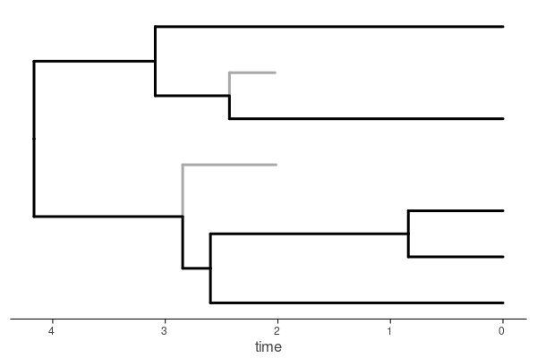
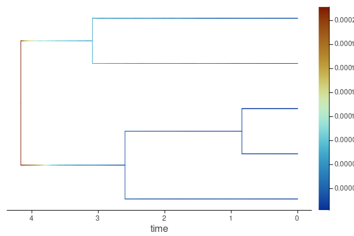
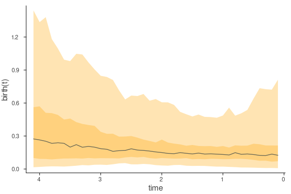
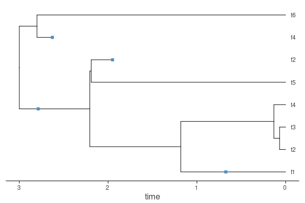

# Quick runs

You can quickly run any of the models in Tapestree.jl by following these minimal tutorials under mostly default parameters. To conduct thorough analyses, add options, use additional models, or several other capabilities (such as plotting) please read the [Manual](@ref).

## INSANE models using Bayesian Data augmentation (DA)

INSANE models output two files, a `.log` file that saves the standard MCMC parameters trace (can be read in by Tracer [link](https://github.com/beast-dev/tracer/releases/tag/v1.7.2)) and a `.txt` file with the data augmented (DA) trees that can be read using `iread()` function. These two vectors (named below `r` and `tv` consistently for the parameter Matrix and the DA tree vector) are also returned by the function and kept in memory on the active Julia sessions. Moreover, the DA tree vector can be exported as an annotated _nexus_ file using `write_nexus()`, allowing interoperability with other phylogenetic software.


### Reading a newick tree

To read a tree in newick format you can just use
```julia
tree = read_newick("<tree file directory in newick format>")
```

You can plot this tree by loading the `Plots` package and then doing
```julia
plot(tree)
```


!!! note
    This is the `tree_5.tre` in the Tapestree `data` directory.

### Diversification (birth-death) models

#### Constant Birth-Death (CBD):

```julia
using Tapestree

tree = read_newick("<tree file directory in newick format>")

r, tv = insane_cbd(tree,
                   niter = 100_000,
                   nthin = 1_000,
                   ofile = "<out files directory>")
```

!!! note
    For the following I used here the 5 tip tree `tree_5.tre` in the `data` directory of Tapestree.

The `tv` is a vector of all data augmented (DA) posterior trees. You can plot one of them
doing
```julia
plot(tv[1])
```


You can discern the data augmented lineages by using `showda = true`
```julia
plot(tv[1], showda = true, linewidth = 3.0)
```


You can estimate and plot the diversity through time (DTT) every `0.1` time units by doing
```julia
plot(ltt(tv), 0.1)
```


#### Birth-Death Diffusion (BDD):

```julia
using Tapestree

tree = read_newick("<tree file directory in newick format>")

r, tv = insane_gbmbd(tree,
                     niter = 100_000,
                     nthin = 1_000,
                     ofile = "<out files directory>")
```
!!! info
    For no extinction use `insane_gbmpb`, for constant extinction use `insane_gbmce`, for constant turnover use `insane_gbmct`.

!!! note
    For the following I used here the 5 tip tree `tree_5.tre` in the data directory of Tapestree.

To estimate the posterior average speciation and extinction rates along the tree,
we first remove the DA lineages
```julia
tv0 = remove_unsampled(tv)
```
And then estimate the average
```julia
tm = imean(tv0)
```

You can plot the tree "painted" by the latent speciation rates
```julia
plot(tm, birth)
```


Or the extinction rates
```julia
plot(tm, death)
```


We can also plot, say, the cross-lineage average speciation rate
```julia
plot(birth, 0.1, tv)
```



One can save this tree vector as an annotated nexus file that can be read by other phylogenetic software
```julia
write_nexus(tv, tree, "<output directory>")
```


#### Constant Fossilized Birth-Death (CFBD):
```julia
using Tapestree

tree = read_newick("<tree file directory in newick format>", true)

r, tv = insane_cfbd(tree,
                    niter = 100_000,
                    nthin = 1_000,
                    ofile = "<out files directory>")
```
!!! info 
    to read FBD trees, you need to add `true` as a second argument in `read_newick`.

!!! note
    For the following I used here the 6 tip fossil tree `tree_6.tre` in the data directory of Tapestree.

One can plot the input tree
```julia
plot(tree)
```


And compare it to one randomly chosen posterior data augmented trees
```julia
plot(rand(tv), showda = true, linewidth = 3)
```


Tapestree allows for piece-wise constant rates of preservation that change at times specified by the user ("episodic FBD"). For example, if the input is a tree with, say, ``tree height = 3.0`` (the depth of the tree), we could want to specify that the rates of fossilization are different between, say, the periods ``(3.0, 2.1)``, ``(2.1,0.9)``, and ``(0.9,0)``.

For this it suffices to include a (`Float64`) vector of times where the fossilization rate, ``\psi``, is allowed to change in the `ψ_epoch` argument

```julia
r, tv = insane_cfbd(tree,
                    niter   = 100_000,
                    nthin   = 1_000,
                    ψ_epoch = [2.1, 0.9],
                    ofile   = "<out files directory>")
```

Finally, it might be desirable to incorporate fossil occurrences of species in the empirical tree that were not included. For instance, we might have a species represented only by one fossil occurrence as a tip in the tree, but we have information of some other fossil occurrences of this species. Including this information will better inform the fossilization rate.

To continue the example above, suppose that we have ``2``, ``1`` and ``3`` _additional_ fossil occurrences for species represented in our tree, for the three periods. To include this information, we simply specify it in the `f_epoch` argument:

```julia
r, tv = insane_cfbd(tree,
                    niter   = 100_000,
                    nthin   = 1_000,
                    ψ_epoch = [2.1, 0.9],
                    f_epoch = [2, 1, 3],
                    ofile   = "<out files directory>")
```

Let's look at the diversity through time, and add also the LTT from the empirical tree for comparison
```julia
plot(ltt(tv), 0.1)
plot!(ltt(tree), linewidth = 2.0, linestyle = :dash)
```


#### Fossilized Birth-Death Diffusion (FBDD):

```julia
using Tapestree

tree = read_newick("<tree file directory in newick format>", true)

r, tv = insane_gbmfbd(tree,
                      niter = 100_000,
                      nthin = 1_000,
                      ofile = "<out files directory>")
```
!!! note
    For the following I used here the 6 tip fossil tree `tree_6.tre` in the data directory of Tapestree.

!!! info 
    To have piece-wise constant preservation rates and add additional fossil occurrences, use the same arguments introduced just above in [Constant fossilized birth-death process (CFBD)](@ref).

We can plot the average speciation and extinction, after removing unsampled (DA) lineages and estimating the average using
```julia
tv0 = remove_unsampled(tv)
tm  = imean(tv0)
p0 = plot(tm, birth)
p1 = plot(tm, death)
plot(p0, p1, linewidth = 3.0)
```


As with other birth-death diffusion models, we can plot the cross-lineage average speciation rate and extinction rates
```julia
p0 = plot(birth, 0.1, tv)
p1 = plot(death, 0.1, tv)
plot(p0, p1)
```


### Diffused Brownian motion (DBM) model

```julia
using Tapestree, DelimitedFiles

tree = read_newick("<tree file directory in newick format>", true)
tdat = readdlm("<trait file>")
xavg = Dict{String, Float64}(tdat[i,1] => tdat[i,2] for i in 1:size(tdat,1))

r, tv = insane_dbm(tree, 
                   xavg,
                   niter = 100_000,
                   nthin = 1_000,
                   ofile = "<out files directory>")
```
!!! info 
    Here the `<trait file>` would be a simple `.txt` file with species names in the first column and continuous trait values in the second. For this example I used the `tree_6.tre` tree and trait data in `trait.txt` in the `data` directory of Tapestree.

We can plot one random posterior trait history on the tree
```julia
plot(rand(tv), xv, linewidth = 3.0)
```


Or we can plot the phenogram using
```julia
plot(xv, rand(tv), linewidth = 3.0)
```


We can estimate the average posterior for the traits and rates
```julia
tm = imean(tv)
```
and plot the average paths for trait and rate evolution
```julia
p0 = plot(xv, tm, linewidth = 3.0)
p1 = plot(lσ2, tm, linewidth = 3.0)
plot(p0, p1)
```


To add trait uncertainty around the average values (assumed to be Normally distributed), one needs another Dictionary, just as with `xavg` above, but having each species point to the standard deviation to set the argument `xs`. For instance, if we have another simple `.txt` file with species names in the first column and standard deviations in the second:

```julia
tvar = readdlm("<trait file>")
xstd = Dict{String, Float64}(tdat[i,1] => tdat[i,2] for i in 1:size(tdat,1))

r, tv = insane_dbm(tree, 
                   xavg,
                   xs    = xstd,
                   niter = 100_000,
                   nthin = 1_000,
                   ofile = "<out files directory>")
```

## ESSE & TRIBE

For ESSE and TRIBE go directly to the manual [ESSE](@ref) & [TRIBE](@ref).

